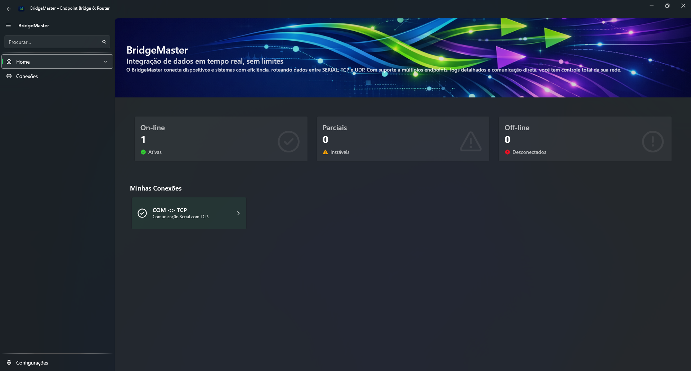
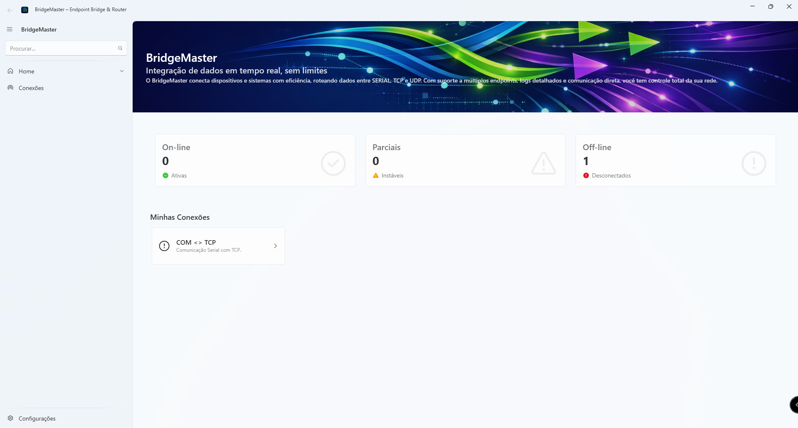
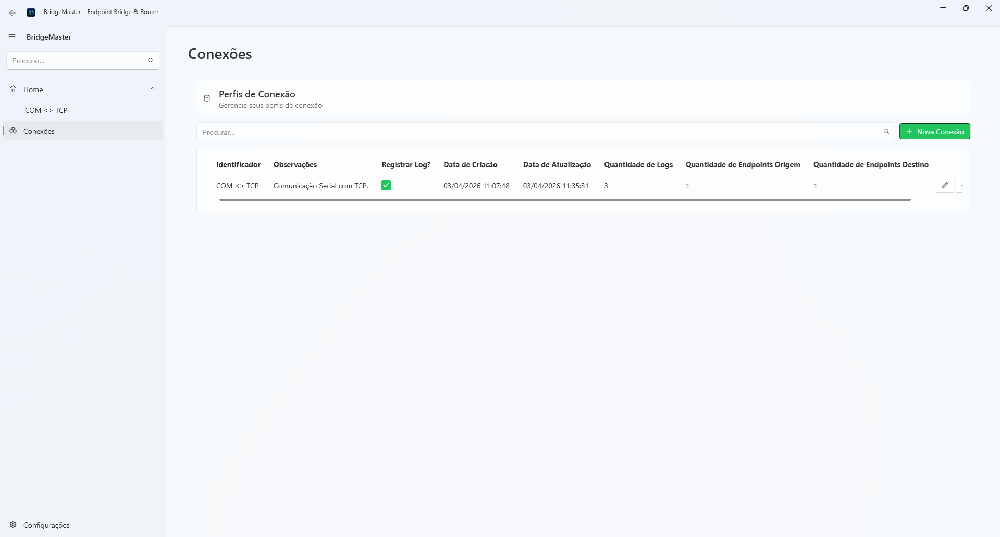
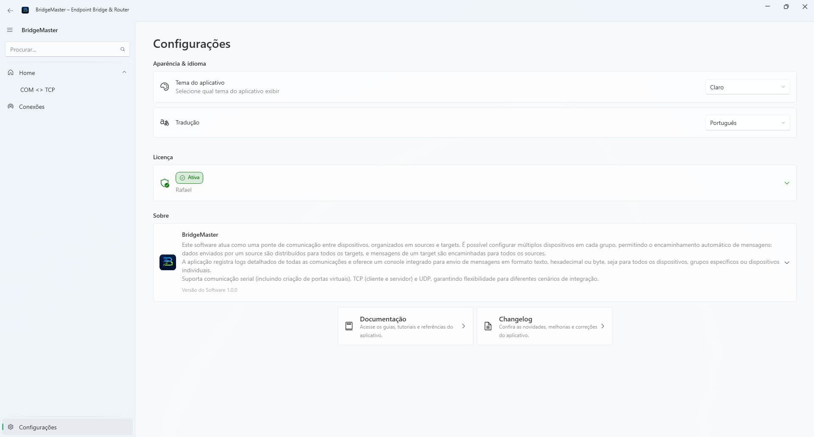
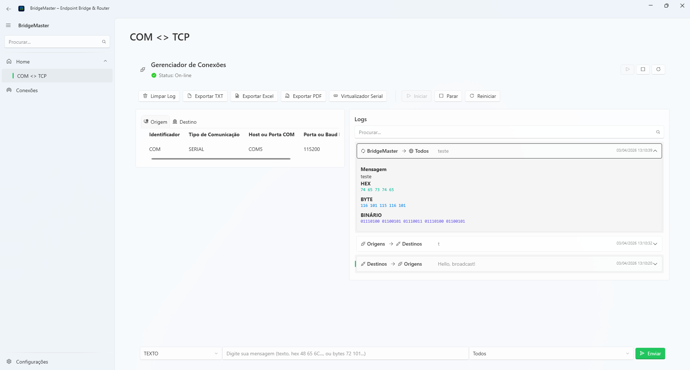
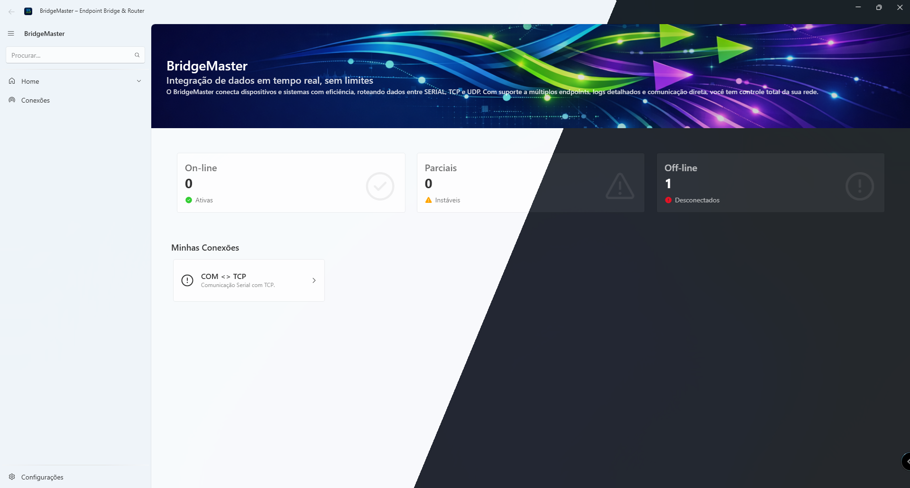
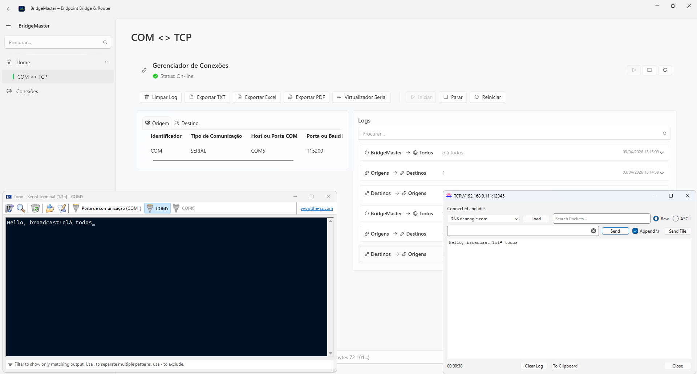

# BridgeMaster

  

  <b>Serial • TCP • UDP Integration Middleware</b> 
  Bridge multiple communication endpoints with real-time routing and monitoring

  

---

## 🇧🇷 Português

### 🚀 Sobre o BridgeMaster

O **BridgeMaster** é uma plataforma de integração que cria uma ponte entre múltiplos endpoints de comunicação, permitindo o roteamento e encaminhamento de mensagens entre diferentes protocolos e interfaces.

---

### 🖼️ Interface

#### 🏠 Home

#### 📝 Cadastro de Endpoints

#### ⚙️ Configurações

#### 🧭 Gerenciamento de Endpoints

#### 🌗 Tema Claro / Escuro

#### 📡 Comunicação em Tempo Real

> Exemplo: terminal serial e terminal TCP trocando mensagens em tempo real

---

### 🧩 Problema que resolve

Integrar diferentes tipos de comunicação (Serial, TCP, UDP) normalmente exige esforço elevado e pouca visibilidade.
O BridgeMaster centraliza tudo em uma única interface com monitoramento completo.

---

### ⚙️ Como funciona

* **Sources** → origem das mensagens
* **Targets** → destino das mensagens

Fluxo:

* Source → envia para todos Targets
* Target → responde para todos Sources

---

### 🔌 Endpoints suportados

* Serial físico (COM)
* Serial virtual
* TCP Server
* TCP Client
* UDP Client

---

### ✨ Funcionalidades

* Múltiplos endpoints simultâneos
* Encaminhamento automático
* Logs completos
* Envio manual (Texto / Hex / Byte)
* Servidor TCP integrado
* Porta serial virtual
* CLI e DLL gratuitos

---

### 💡 Casos de uso

* Dispositivo serial → múltiplos PCs via TCP
* Monitoramento remoto (LAN/VPN)
* Gateway entre protocolos
* Simulação de comunicação
* Integração hardware/software

---

### 🖥️ Plataforma

* Windows
* WPF (.NET 10)
* SQLite local

---

### 🔐 Licenciamento

* 7 dias grátis
* Após isso, requer licença

---

## 💰 Preço

  <b>Comece gratuitamente. Evolua conforme sua necessidade.</b>

---

| Plano                 | Ideal para              | Recursos                                                                                                                | Preço                                            |
| --------------------- | ----------------------- | ----------------------------------------------------------------------------------------------------------------------- | ------------------------------------------------ |
| 🟢 **Starter**        | Testes e uso básico     | 1 bridge ativa Até 5 endpoints Logs básicos                                                                       | **Gratuito (limitado)**                          |
| 🔵 **Professional ⭐** | Uso profissional        | Bridges múltiplas Endpoints ilimitados Logs completos Serial virtual + TCP server Envio manual de mensagens | **R$ 79–149 / mês** ou **R$ 397–697 licença** |
| 🟣 **Enterprise**     | Empresas e alta demanda | Tudo do Professional Suporte prioritário Customizações Acesso antecipado a novas features                      | **Sob consulta**                                 |

  

---

### 🔐 Trial

* 7 dias de teste gratuito com acesso completo
* Após o período, algumas funcionalidades podem ser limitadas ou bloqueadas
* Licença necessária para uso contínuo

---

### 💡 Notas

* Licenças são vinculadas à máquina
* Descontos podem ser aplicados para uso corporativo
* Entre em contato para planos personalizados

---

---

## 🇺🇸 English

### 🚀 About BridgeMaster

**BridgeMaster** is an integration platform that bridges multiple communication endpoints, enabling real-time message routing across different protocols.

---

### 🖼️ Interface

#### 🏠 Home

#### 📝 Endpoint Registration

#### ⚙️ Settings

#### 🧭 Endpoint Management

#### 🌗 Light / Dark Theme

#### 📡 Real-Time Communication

> Example: serial terminal communicating with a TCP terminal in real time

---

### 🧩 Problem it solves

Integrating Serial, TCP, and UDP communications is complex and fragmented.
BridgeMaster centralizes everything into a single, observable system.

---

### ⚙️ How it works

* **Sources** → message origin
* **Targets** → message destination

Flow:

* Source → forwarded to all Targets
* Target → forwarded to all Sources

---

### 🔌 Supported endpoints

* Physical Serial (COM)
* Virtual Serial
* TCP Server
* TCP Client
* UDP Client

---

### ✨ Features

* Multi-endpoint configuration
* Automatic routing
* Full logging
* Manual message sending
* Built-in TCP server
* Virtual serial ports
* Free CLI and DLL

---

### 💡 Use cases

* Serial device → multiple TCP clients
* Remote monitoring (LAN/VPN)
* Protocol gateway
* Communication simulation
* Hardware/software integration

---

### 🖥️ Platform

* Windows
* WPF (.NET 10)
* SQLite (local DB)

---

### 🔐 Licensing

* 7-day free trial
* License required after trial

---

## 💰 Pricing

  <b>Start free. Upgrade when you need more power.</b>

---

| Plan                  | Best for                               | Features                                                                                                         | Price                                         |
| --------------------- | -------------------------------------- | ---------------------------------------------------------------------------------------------------------------- | --------------------------------------------- |
| 🟢 **Starter**        | Testing and basic usage                | 1 active bridge Up to 5 endpoints Basic logs                                                               | **Free (limited)**                            |
| 🔵 **Professional ⭐** | Professional use                       | Multiple bridges Unlimited endpoints Full logging Virtual serial + TCP server Manual message sending | **$15–30 / month** or **$80–140 lifetime** |
| 🟣 **Enterprise**     | Companies and high-demand environments | Everything in Professional Priority support Custom builds Early access to new features                  | **Contact us**                                |

  

---

### 🔐 Trial

* 7-day free trial with full access
* After the trial period, some features may be limited or blocked
* License required for continued use

---

### 💡 Notes

* Licenses are machine-bound
* Discounts may apply for corporate use
* Contact us for customized plans

---

### ℹ️ Note

This repository is used only for releases and licensing.
Source code is private.

---

### 📧 Contato
Desenvolvido por Rafael Pinal
© 2026 Rafael Pinal. Todos os direitos reservados.
Uso de licenças é obrigatório para acesso completo ao software.
Contato e Suporte
Email: helpdesk@cpsystems.com.br
Para dúvidas de licença, instalação ou bugs.
